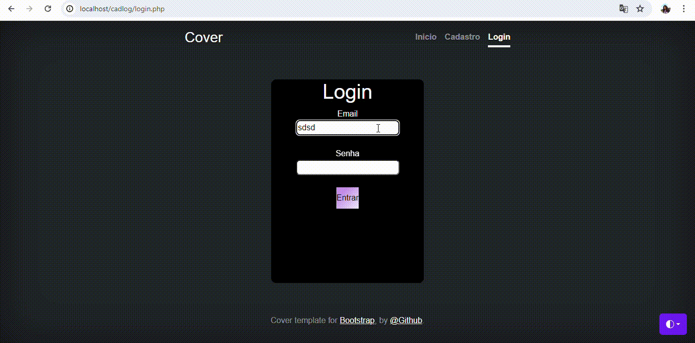

# Atividade Tela de Login, Cadastro e Inicial
Neste projeto, realizei ajustes em um site, criando páginas de início, cadastro e login. O intuito da atividade foi principalmente a melhora das habilidades de programação e a aplicação das mesmas em nosso projeto final ou TCC.

## Fonte utilizada

Para a criação da aplicação descrita nesta tarefa, utilizei o Bootstrap 5+. Um dos modelos disponíveis e que se adequa perfeitamente a essa atividade é o exemplo "Cover" do Bootstrap, disponível em: Bootstrap Cover Example.

## O QUE FOI FEITO?

O menu superior de navegação foi ajustado para incluir as seguintes páginas:

Início (index.php)
Cadastro (cad.php)
Login (login.php)

A estrutura dos arquivos da aplicação é a seguinte:

index.php: Tela principal da aplicação.
login.php: Tela de login.
cad.php: Tela de cadastro.
styles.css: Arquivo CSS personalizado para estilizar as páginas.